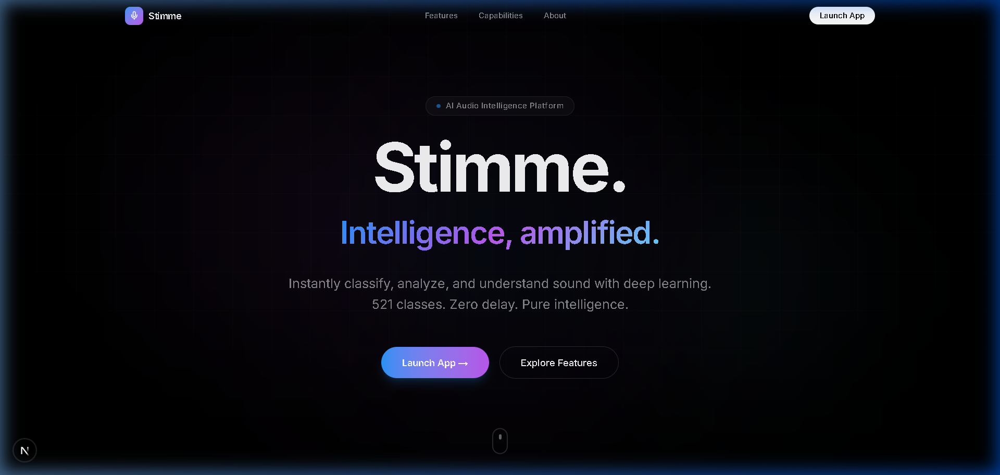
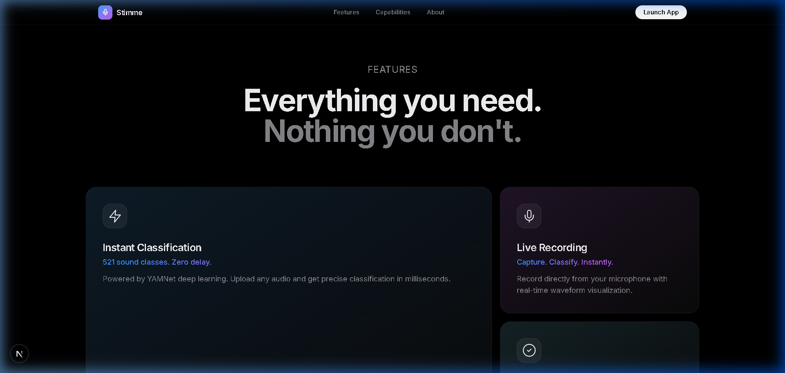
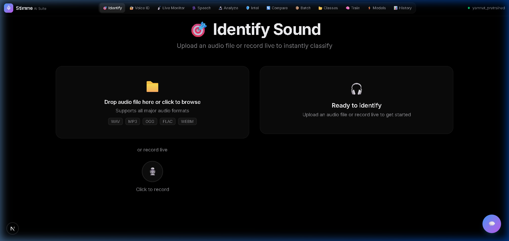

<div align="center">


<br><br>

# 🎵 STIMME

### AI Audio Intelligence Suite

[](https://python.org)
[](https://tensorflow.org)
[](https://fastapi.tiangolo.com)
[](https://nextjs.org)
[](https://react.dev)
[](LICENSE)
[](https://github.com/karthik2004-pai/Stimme)

**A production-grade, fully offline AI audio intelligence platform built with deep learning.**  
*Real-time sound classification · Frequency spectrum analysis · Audio forensics · Speaker diarization · Steganography detection · Acoustic threat detection · Audio enhancement · Custom model training*

[🚀 Quick Start](#-quick-start) · [✨ Features](#-features) · [🏗️ Architecture](#%EF%B8%8F-architecture) · [📸 Screenshots](#-screenshots) · [🧠 AI Models](#-ai-models) · [📖 API Reference](#-api-reference)

---

</div>

## 📸 Screenshots

<div align="center">

### 🏠 Landing Page — Apple-inspired Hero


<br>

### ✨ Feature Showcase — Bento Grid


<br>

### 🎯 App Dashboard — Sound Identification


</div>

---

## 🔥 Highlights

<table>
<tr>
<td width="50%">

### 🎯 Instant Sound Identification
Upload any audio file or record from your microphone — Stimme identifies sounds in real-time using Google's **YAMNet** model trained on **521 sound categories** from AudioSet.

### 🔬 Deep Frequency Analysis
Professional-grade spectral analyzer with **real-time FFT spectrum**, **spectrogram heatmap**, **7-band frequency analysis**, and comprehensive spectral features — all rendered on interactive HTML5 Canvas.

### 🛡️ Intelligence Suite
Military-grade audio forensics including **tampering detection**, **speaker diarization**, **steganography scanning**, **acoustic threat detection**, and **AI-powered noise removal**.

</td>
<td width="50%">

### 🧠 Train Custom Models
Build your own audio classifiers without writing code. Choose between **YAMNet Transfer Learning** (fast, 10+ samples) or **Custom CNN** (deeper, 50+ samples) — training happens 100% locally.

### 🔒 Privacy-First Architecture
**Zero cloud dependencies.** Every computation — from TensorFlow inference to audio processing — runs entirely on your machine. No data ever leaves your system.

### 🎨 Premium UI Design
Apple-inspired **"Neural Pulse"** dark theme with glassmorphism, smooth animations, and a responsive component library — designed to look stunning on any device.

</td>
</tr>
</table>

---

## ✨ Features

### 🎯 Sound Identification Engine
- Upload **WAV, MP3, OGG, FLAC, WEBM** files or record live from microphone
- **521-class** instant recognition via YAMNet (animals, vehicles, music, speech, nature, urban sounds, and more)
- Interactive **waveform** and **spectrogram** visualization of uploaded audio
- Confidence meter with animated circular gauge
- Classification history with persistent SQLite storage

### 🔬 Frequency Spectrum Analyzer
- **Real-time FFT Spectrum** — 128-band live frequency visualization during playback
- **Spectrogram Heatmap** — Color-coded frequency-over-time display
- **Waveform Display** — Raw audio shape visualization
- **7-Band Frequency Analysis** — Sub-Bass through Brilliance with dB meters
- **Spectral Features** — Centroid, Rolloff, Flatness, Dominant Frequency, RMS & Peak Level
- Full playback controls with seek bar and volume

### 🛡️ Audio Intelligence Suite

| Module | Capability |
|--------|-----------|
| 🔍 **Forensics** | Splice detection, ENF analysis, compression artifacts, noise floor consistency, statistical anomaly checks |
| 🎭 **Speaker Diarization** | Identifies who spoke when, color-coded timeline, per-speaker speaking time stats |
| 🔐 **Steganography Detection** | LSB analysis, Chi-Square test, spectral spread, phase analysis, echo hiding detection |
| 💥 **Threat Detection** | Gunshots, explosions, screams, alarms, breaking glass — with severity levels and timestamps |
| 🧹 **Audio Enhancement** | Spectral gating noise removal, voice bandpass filtering, before/after comparison, downloadable output |

### 🧠 Custom Model Training
- **YAMNet Transfer Learning** — Leverages Google's pre-trained embeddings, trains in ~1-2 minutes with just 10 samples/class
- **Custom CNN** — 4-layer Conv2D network on mel spectrograms, trains from scratch for niche categories
- Automatic **data augmentation** (time shift, noise injection, pitch shift, speed change)
- Real-time training progress with epoch, accuracy, and validation metrics
- Model management dashboard to switch between trained models

### 📂 Sound Class Management
- **30+ pre-built categories** (Birds, Vehicles, Weather, Music, Human, Nature, Urban)
- Create unlimited custom classes with descriptions
- Drag-and-drop multi-file sample upload
- Per-class audio sample management with playback

### 💬 Built-in AI Chatbot Guide
- Interactive chatbot covering all features
- Context-aware suggestions based on current page
- Markdown-formatted responses with tables and code blocks
- Knowledge base with 15+ detailed topic entries

---

## 🏗️ Architecture

```
┌─────────────────────────────────────────────────────────────────┐
│                     STIMME Architecture                         │
├─────────────────────────────────────────────────────────────────┤
│                                                                 │
│  ┌──────────────┐    ┌──────────────┐    ┌──────────────────┐  │
│  │   Landing     │    │   Frontend    │    │     Backend      │  │
│  │   (Next.js)   │───▶│   (Vanilla)   │───▶│    (FastAPI)     │  │
│  │   Port 3000   │    │   HTML/CSS/JS │    │    Port 8000     │  │
│  └──────────────┘    └──────────────┘    └────────┬─────────┘  │
│                                                    │             │
│                           ┌────────────────────────┤             │
│                           │                        │             │
│                    ┌──────▼──────┐          ┌──────▼──────┐     │
│                    │  TensorFlow  │          │   SQLite     │     │
│                    │  + TF Hub    │          │   Database   │     │
│                    │  (YAMNet)    │          │              │     │
│                    └──────┬──────┘          └─────────────┘     │
│                           │                                      │
│              ┌────────────┼────────────┐                        │
│              │            │            │                        │
│        ┌─────▼────┐ ┌────▼─────┐ ┌───▼──────┐                 │
│        │  librosa  │ │  scipy   │ │ scikit-  │                 │
│        │  Audio    │ │  Signal  │ │ learn    │                 │
│        │  Process  │ │  Process │ │ ML Utils │                 │
│        └──────────┘ └──────────┘ └──────────┘                 │
│                                                                 │
└─────────────────────────────────────────────────────────────────┘
```

### Tech Stack

| Layer | Technology | Purpose |
|-------|-----------|---------|
| **Landing Page** | Next.js 15, React 19, Framer Motion, Tailwind CSS 4 | Premium animated landing page with scroll reveals |
| **App Frontend** | Vanilla HTML5, CSS3, JavaScript ES6+ | Zero-dependency SPA with Canvas-based visualizations |
| **Backend API** | Python, FastAPI, Uvicorn | High-performance async REST API |
| **ML Engine** | TensorFlow 2.x, TF Hub, YAMNet | Audio classification and transfer learning |
| **Audio Processing** | librosa, soundfile, pydub, scipy | Feature extraction, format conversion, enhancement |
| **Database** | SQLAlchemy + SQLite | Classification history, class management |
| **ML Utilities** | scikit-learn, NumPy | Clustering (speaker diarization), preprocessing |

---

## 📂 Project Structure

```
Stimme/
├── 🎨 landing/                    # Next.js 15 Landing Page
│   ├── app/
│   │   ├── page.tsx               # Landing page route
│   │   ├── app/page.tsx           # Full app route (/app)
│   │   ├── layout.tsx             # Root layout
│   │   └── globals.css            # Tailwind + custom styles
│   └── components/
│       ├── Hero.tsx               # Animated hero section
│       ├── BentoGrid.tsx          # Feature showcase grid
│       ├── Capabilities.tsx       # Capabilities carousel
│       ├── Navbar.tsx             # Navigation bar
│       ├── Footer.tsx             # Footer with links
│       ├── CTA.tsx                # Call-to-action section
│       ├── ScrollReveal.tsx       # Scroll animation wrapper
│       ├── IdentifyPanel.tsx      # Sound identification UI
│       ├── AnalyzePanel.tsx       # Spectrum analyzer UI
│       ├── IntelPanel.tsx         # Intelligence suite UI
│       ├── ClassesPanel.tsx       # Class management UI
│       ├── TrainPanel.tsx         # Model training UI
│       ├── ModelsPanel.tsx        # Model management UI
│       ├── HistoryPanel.tsx       # Classification history
│       ├── VoiceMatchPanel.tsx    # Voice matching UI
│       ├── LiveMonitor.tsx        # Real-time audio monitor
│       ├── BatchProcessor.tsx     # Batch processing UI
│       ├── ComparePanel.tsx       # Audio comparison UI
│       ├── SpeechToText.tsx       # Speech recognition UI
│       ├── Chatbot.tsx            # AI assistant chatbot
│       └── shared.tsx             # Shared components
│
├── 🖥️ frontend/                   # Vanilla JS Dashboard (served by FastAPI)
│   ├── index.html                 # Main SPA (684 lines)
│   ├── css/styles.css             # Neural Pulse design system (2748 lines)
│   └── js/
│       ├── app.js                 # App controller (1571 lines)
│       └── chatbot.js             # AI chatbot engine (994 lines)
│
├── ⚙️ backend/                    # Python FastAPI Backend
│   ├── main.py                    # Application entry point
│   ├── config.py                  # Configuration constants
│   ├── database.py                # SQLAlchemy models & setup
│   ├── audio_processor.py         # Audio processing pipeline
│   ├── models/
│   │   ├── yamnet_model.py        # YAMNet classifier + transfer learning
│   │   ├── cnn_model.py           # Custom CNN classifier
│   │   └── model_manager.py       # Model registry & switching
│   ├── services/
│   │   ├── classifier.py          # Classification orchestrator
│   │   ├── trainer.py             # Training pipeline
│   │   ├── class_manager.py       # Sound class CRUD
│   │   ├── forensics_analyzer.py  # Audio forensics engine
│   │   ├── speaker_analyzer.py    # Speaker diarization
│   │   ├── steganalysis.py        # Steganography detection
│   │   ├── threat_detector.py     # Acoustic threat detection
│   │   ├── audio_enhancer.py      # Noise removal & enhancement
│   │   └── voice_matcher.py       # Voice matching service
│   ├── api/
│   │   ├── routes_classify.py     # Classification endpoints
│   │   ├── routes_classes.py      # Class management endpoints
│   │   ├── routes_training.py     # Training endpoints
│   │   ├── routes_models.py       # Model management endpoints
│   │   ├── routes_analyze.py      # Frequency analysis endpoints
│   │   ├── routes_intelligence.py # Intel suite endpoints
│   │   └── routes_voice.py        # Voice matching endpoints
│   ├── requirements.txt           # Python dependencies
│   └── data/                      # Auto-created runtime data
│
├── start.ps1                      # One-click launcher (Windows)
├── .gitignore
├── LICENSE
└── README.md
```

---

## 🚀 Quick Start

### Prerequisites

- **Python 3.9+** with pip
- **Node.js 18+** with npm
- **4GB+ RAM** (for TensorFlow)
- **ffmpeg** *(optional, for extended audio format support)*

### Installation

```bash
# 1. Clone the repository
git clone https://github.com/karthik2004-pai/Stimme.git
cd Stimme

# 2. Install backend dependencies
cd backend
pip install -r requirements.txt

# 3. Install landing page dependencies
cd ../landing
npm install

# 4. Start both servers
cd ..
```

### Running

**Option A: One-Click Launch (Windows)**
```powershell
powershell -ExecutionPolicy Bypass -File start.ps1
```

**Option B: Manual Start (Two terminals)**

Terminal 1 — Backend:
```bash
cd backend
python main.py
# Server starts at http://localhost:8000
```

Terminal 2 — Landing Page:
```bash
cd landing
npm run dev
# Landing page at http://localhost:3000
```

### Access

| URL | Description |
|-----|-------------|
| `http://localhost:3000` | 🎨 Premium landing page |
| `http://localhost:3000/app` | 🚀 Full application dashboard |
| `http://localhost:8000` | ⚙️ Backend API + vanilla frontend |
| `http://localhost:8000/docs` | 📖 Interactive API documentation |

### First Run Notes
- YAMNet model downloads automatically on first launch (~200MB, one-time)
- SQLite database and default sound classes are auto-created
- The pre-trained model classifies **521 sound types** immediately

---

## 🧠 AI Models

### YAMNet (Pre-trained)
- **Source:** Google's TF Hub — trained on millions of AudioSet clips
- **Classes:** 521 sound categories
- **Input:** 16kHz mono audio (any length)
- **Architecture:** MobileNet v1 backbone
- **Embeddings:** 1024-dimensional feature vectors
- **Use case:** General-purpose sound identification

### YAMNet Transfer Learning
- **Base:** YAMNet embeddings → Custom Dense classifier head
- **Architecture:** Dense(256) → BN → Dropout → Dense(128) → BN → Dropout → Softmax
- **Training time:** ~1-2 minutes
- **Min samples:** 10 per class
- **Use case:** Quickly specialize on custom categories

### Custom CNN
- **Architecture:** 4× Conv2D blocks (BatchNorm + MaxPool) → GlobalAvgPool → Dense → Softmax
- **Input:** 128-band mel spectrograms
- **Training time:** ~5-10 minutes
- **Min samples:** 50 per class
- **Use case:** Niche audio categories requiring deep specialization

---

## 📖 API Reference

### Classification
| Method | Endpoint | Description |
|--------|----------|-------------|
| `POST` | `/api/classify/upload` | Classify an uploaded audio file |
| `POST` | `/api/classify/record` | Classify recorded microphone audio |
| `GET` | `/api/classify/history` | Get classification history |

### Frequency Analysis
| Method | Endpoint | Description |
|--------|----------|-------------|
| `POST` | `/api/analyze/upload` | Full spectral analysis of audio |

### Intelligence Suite
| Method | Endpoint | Description |
|--------|----------|-------------|
| `POST` | `/api/intel/forensics` | Audio forensics & tampering detection |
| `POST` | `/api/intel/speakers` | Speaker diarization |
| `POST` | `/api/intel/steg` | Steganography detection |
| `POST` | `/api/intel/threats` | Acoustic threat detection |
| `POST` | `/api/intel/enhance` | Audio enhancement |

### Class Management
| Method | Endpoint | Description |
|--------|----------|-------------|
| `GET` | `/api/classes` | List all sound classes |
| `POST` | `/api/classes` | Create a new class |
| `POST` | `/api/classes/{id}/samples` | Upload audio samples |
| `DELETE` | `/api/classes/{id}` | Delete a class |

### Training & Models
| Method | Endpoint | Description |
|--------|----------|-------------|
| `POST` | `/api/training/start` | Start model training |
| `GET` | `/api/training/status` | Get training progress |
| `GET` | `/api/models` | List all models |
| `POST` | `/api/models/{name}/activate` | Switch active model |

> 📖 Full interactive API docs available at `http://localhost:8000/docs` when the server is running.

---

## 🎯 How to Train Custom Models

```
Step 1                    Step 2                    Step 3
┌──────────────┐          ┌──────────────┐          ┌──────────────┐
│  📂 Classes   │          │  📤 Upload    │          │  🧠 Train     │
│              │   ───▶   │              │   ───▶   │              │
│ Create your  │          │ 10+ audio    │          │ Select arch  │
│ categories   │          │ samples each │          │ & start      │
└──────────────┘          └──────────────┘          └──────────────┘
                                                           │
Step 6                    Step 5                    Step 4  │
┌──────────────┐          ┌──────────────┐          ┌──────▼───────┐
│  🎯 Identify  │          │  ⚡ Activate  │          │  📊 Results   │
│              │   ◀───   │              │   ◀───   │              │
│ Test with    │          │ Switch to    │          │ View accuracy │
│ new audio!   │          │ your model   │          │ & val metrics │
└──────────────┘          └──────────────┘          └──────────────┘
```

1. Go to **Classes** → Create a new sound class (e.g., "Dog Bark")
2. Upload **10+ diverse audio samples** per class
3. Go to **Train** → Select classes → Choose architecture
4. Click **🚀 Start Training** → Monitor real-time progress
5. Go to **Models** → Click **Activate** on your new model
6. Go to **Identify** → Upload audio to test your model!

> 💡 **Pro Tip:** YAMNet Transfer Learning is recommended — it uses Google's pre-trained embeddings so it needs fewer samples and trains 5x faster than the CNN option.

---

## 🔒 Privacy & Security

- **100% Offline** — No cloud APIs, no external requests, no telemetry
- **Local Processing** — All ML inference runs on your CPU/GPU
- **Local Storage** — SQLite database stored on your machine only
- **No Data Collection** — Zero audio data ever leaves your system
- **Open Source** — Full codebase transparency

---

## 🛠️ Troubleshooting

<details>
<summary><b>🔴 "Connecting..." status in the navbar</b></summary>

The backend server is not running. Start it with:
```bash
cd backend && python main.py
```
</details>

<details>
<summary><b>🔴 Classification returns Error 500</b></summary>

Ensure the backend is running and YAMNet has finished loading. Check the terminal for error messages. First startup may take 30-60 seconds for model initialization.
</details>

<details>
<summary><b>🔴 Microphone not working</b></summary>

Allow microphone access in your browser settings. Ensure no other application is using the mic. Try refreshing the page.
</details>

<details>
<summary><b>🔴 Audio format not supported</b></summary>

Install ffmpeg for extended format support:
- **Windows:** `choco install ffmpeg` or download from [ffmpeg.org](https://ffmpeg.org)
- **macOS:** `brew install ffmpeg`
- **Linux:** `sudo apt install ffmpeg`
</details>

<details>
<summary><b>🔴 Landing page not loading</b></summary>

Ensure Node.js is installed and in your PATH. Then:
```bash
cd landing && npm install && npm run dev
```
</details>

---

## 📊 Project Stats

| Metric | Value |
|--------|-------|
| Total Source Files | **40+** |
| Backend Code | **~15,000 lines** (Python) |
| Frontend Code | **~6,000 lines** (HTML/CSS/JS) |
| Landing Page | **~21 React components** |
| API Endpoints | **15+** |
| Pre-trained Classes | **521** |
| Intelligence Modules | **5** |
| Audio Formats | **5+** (WAV, MP3, OGG, FLAC, WEBM) |

---

## 🤝 Contributing

Contributions are welcome! Please read the [Contributing Guide](CONTRIBUTING.md) for details.

1. Fork the repository
2. Create your feature branch (`git checkout -b feature/amazing-feature`)
3. Commit your changes (`git commit -m 'Add amazing feature'`)
4. Push to the branch (`git push origin feature/amazing-feature`)
5. Open a Pull Request

---

## 📄 License

This project is licensed under the **MIT License** — see the [LICENSE](LICENSE) file for details.

---

<div align="center">

**Built with ❤️ using TensorFlow, FastAPI, and Next.js**

*Stimme — German for "Voice"*

⭐ **Star this repo if you find it useful!** ⭐

</div>
